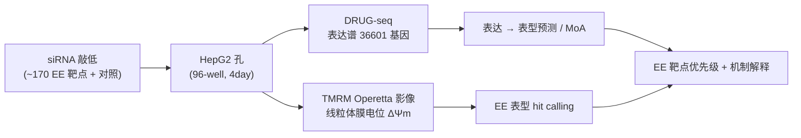
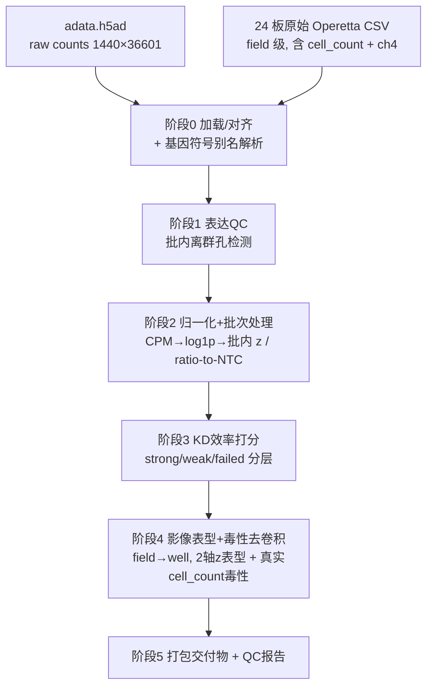

# 研究计划：HepG2 能量消耗（EE）siRNA 敲低 × DRUG-seq × TMRM 影像

- 文档版本：v3（2026-06-10）— 确认 **ch4 = MitoTracker**，纳入 per-mito ΔΨm 与线粒体质量两条机制轴
- 作者：Qiuye Jin (Jay) / NNRCC
- 数据位置（软链接）：`data/drug-seq/` → `../../vAssay_archieve/UHYG/drug-seq`
- 读取环境：`/data/user/QYJI/miniforge3/envs/scvi/bin/python`（`base` 环境无 `anndata`）
- 关联框架：本仓库 `vCell`（latent-additive conditional VAE，扰动响应建模）
- 状态：规划中（数据已勘验，准备工作就绪）

---

## 1. 背景与科学问题

**能量消耗（Energy Expenditure, EE）** 是代谢与肥胖治疗的核心可调节表型。增强细胞/线粒体的产热与氧化（解偶联、脂肪酸氧化、线粒体生物合成）可提高 EE，是减重靶点发现的重要方向。

本数据集在 **HepG2（人肝癌、肝代谢模型）** 中，对约 170 个 EE 相关候选基因做了 **siRNA 敲低（KD）**，并对每个孔同时采集两类读出：

1. **DRUG-seq**：孔级 mini-bulk 转录组（高通量、低成本的全基因组表达谱）。
2. **TMRM 高内涵影像**：TMRM 染料反映 **线粒体膜电位（ΔΨm）**，作为 EE / 线粒体功能的代理表型。



**核心科学问题：**

1. 哪些基因 KD 能产生类似已知 EE 调节剂（解偶联 / AMPK 激活）的线粒体表型？（**hit calling**）
2. 孔级转录组能否预测、并机制性地解释 TMRM 影像表型？（**表达 → 表型**）
3. 每个靶点 KD 扰动了哪些代谢通路，能否构建 EE 靶点的功能图谱？（**MoA**）

---

## 2. 数据集描述

### 2.1 文件清单（`data/drug-seq/`）

| 文件 | 大小 | 内容 |
| --- | --- | --- |
| `adata.h5ad` | 31 MB | 主数据：**1440 孔 × 36601 基因**，原始 UMI counts（CSC 稀疏，min 1 / max 4174 / mean 33） |
| `adata_with_image_4features.h5ad` | 224 MB | 上述 + 4 个 TMRM 影像指标已并入 `obs` |
| `image_4features_aggregate.csv` | 150 KB | 孔级聚合后的 4 个影像指标 |
| `data_ingestion.py` | — | h5ad 勘验报告 CLI（`-f <file>`） |
| `process_image_aggregation.py` | — | 从 Operetta CSV 聚合影像指标并并入 adata |
| `demo.ipynb` | — | 简易演示（仅查看唯一值/列名） |

### 2.2 实验设计

- **样本单位**：孔（well）级 mini-bulk，**非单细胞**；共 **1440 孔**，全部 **4day** 时点。
- **批次**：5 个（`OFGM-0724` 360、`OFGM-1127` 360、`OFGM-0916` 360、`OFGM-0618` 240、`OFGM-1205` 120）。
- **板**：24 板 × 60 孔。
- **类别 `category`**：Target 1092 / 阳性对照 PC 204 / 阴性对照 NC 144。
- **扰动 `group`**：180 种。
  - `NTC` 144 孔（si-非靶向对照，**= vCell 的 control**）。
  - 阳性对照：`BAM15`（线粒体解偶联剂）、`MK8722`（AMPK 激活剂）、`ATP5B`、`SLC25A4`、`PSMC3` 等。
  - 约 170 个候选靶点 siRNA，每个约 6 个重复孔。

### 2.3 TMRM 影像 4 指标

均为 TMRM 通道（ch2，线粒体膜电位）相对核/细胞通道（ch1）的归一化比值：

| 指标 | 含义 | 所属轴 |
| --- | --- | --- |
| `ch2_ch1_intensity_area_ratio` | TMRM 强度 / ch1 面积 | **强度轴** |
| `ch2_ch1_area_area_ratio` | 高电位面积 / ch1 面积 | **高电位面积轴** |
| `ch2_intensity_cell_count_ratio` | TMRM 强度 / 细胞数 | 强度轴（**含毒性混杂**） |
| `ch2_area_cell_count_ratio` | 高电位面积 / 细胞数 | 高电位面积轴（**含毒性混杂**） |

> 孔位通过 `r02c02 → B02` 换算，把影像与转录组按 (`well`, `tmrm_operetta_data_file_name`) 配对。

### 2.4 `obs` 数据字典

| 列 | 类型 | 说明 |
| --- | --- | --- |
| `sample` / `sample_id` | str | 样本唯一 ID |
| `sample_name` | cat | 可读名（如 `siSEC16A_P1_1`） |
| `group` | cat | **扰动靶点 / 对照标签（建模关键列，= `pert_key`）** |
| `category` | cat | Target / PC / NC |
| `batch` / `batch2` / `batch_raw` | cat | 实验批次（**与靶点高度混淆，见 §3.1**） |
| `plate` / `plate_raw` | cat | 板编号 |
| `well` | cat | 孔位（连接影像） |
| `time` | cat | 时点（全部 4day） |
| `num_umis` | float | 文库大小（总 UMI），QC 用 |
| `num_features` | float | 检出基因数，QC 用 |
| `mt_percentage` | float | 线粒体基因比例，QC / 毒性判读用 |
| `tmrm_operetta_data_file_name` | cat | 对应 TMRM 影像板（连接影像） |
| `ch2_*`（4 列） | float | TMRM 影像指标（**仅在 `*_with_image` 文件**） |

---

## 3. 数据现状与关键约束（建模前必须正视的地基事实）

> 以下结论均来自对本数据集的实际勘验（2026-06-10）。它们直接决定课题设计的可行边界。

### 3.1 批次与靶点几乎完全混淆 → 必须"批内相对 NTC 标准化"

- 175 个 Target 靶点中 **98%（171 个）只出现在单一批次/板**。
- 因此 **绝不能跨批次直接比较原始值**；否则靶点效应与批次效应不可分。
- 救济点：**`NTC` 横跨全部 5 个批次**（每批 12–36 孔），`BAM15` / `MK8722` 也覆盖多批次。
- **设计原则（贯穿所有课题）**：任何比较都以 **批内（plate/batch 内）相对同批 NTC 的标准化**（plate-wise z-score 或 ratio-to-NTC）为基础。

### 3.2 影像 assay window 真实，且存在两条正交的 EE 轴

阳性对照相对 NTC 的 z 效应量（用 NTC 的标准差，|z|>2 视为强信号）：

| 对照 | n | intensity_area | area_area | intensity_cell_count | area_cell_count | 解读 |
| --- | --- | --- | --- | --- | --- | --- |
| **BAM15**（解偶联剂） | 72 | −0.15 | **−4.83** | +1.20 | **−4.77** | 高电位**面积塌缩**（ΔΨm↓，符合解偶联生物学） |
| **MK8722**（AMPK 激活） | 72 | **+4.50** | +1.95 | **+3.91** | +1.86 | TMRM **强度升高**（线粒体活性/生物合成↑） |
| ATP5B | 48 | −1.54 | −1.05 | +3.39 | +1.13 | 中等、方向混合 |
| SLC25A4 | 12 | −1.39 | −1.84 | −0.94 | −1.60 | 弱–中，趋于下降 |

- 原始均值对照（节选）：`area_area` 指标 NTC≈0.612、**BAM15≈0.067（大幅塌缩）**、MK8722≈0.832（升高）；`intensity_area` 指标 NTC≈0.063、**MK8722≈0.117（翻倍）**。
- **结论**：4 个指标可归为 **"强度轴"（MK8722 ↑ 锚定）** 与 **"高电位面积轴"（BAM15 ↓ 锚定）** 两条互补方向，构成可用于 EE hit calling 的二维表型空间。

### 3.3 KD 效率普遍偏弱 → KD-QC 必做

KD 孔自身靶基因 logCPM 相对 NTC 的下降（Δ）：

| 靶点 | nKD | Δ logCPM | 靶点 | nKD | Δ logCPM |
| --- | --- | --- | --- | --- | --- |
| EPS15 | 12 | −0.60 | DGAT2 | 6 | −0.37 |
| SLC25A4 | 12 | −0.44 | CKB | 6 | −0.32 |
| PSMC3 | 30 | −0.40 | GRB14 | 6 | −0.31 |
| HSPA4 | 6 | −0.37 | SIRT4 | 6 | −0.23 |
| PGM1 | 6 | −0.24 | SEC16A | 6 | −0.01 |
| **SHISA5** | 6 | **+0.20（未敲下）** | | | |

- 多数靶点仅下降约 20–45%，部分（SHISA5、SEC16A）几乎未见敲低。
- **含义**：阴性结果不可直接解释为"该基因无功能"，可能只是 KD 不足。
- **必做**：对每个靶点先做 KD 效率打分（批内相对 NTC），**按 KD 效率分层/过滤**后再做下游分析。
- 注意：`group` 标签命名与 `var['symbol']` 可能存在别名差异（例如 `ATP5B` 在 `symbol` 中查不到，疑为新命名 `ATP5F1B`），KD-QC 需先做**基因符号别名解析**。

### 3.4 毒性假信号 → 必须做毒性去卷积

- 以细胞数为分母的指标（`*_cell_count_ratio`）在细胞大量死亡时会异常放大：`PSMC3` 的 `intensity_cell_count` z≈**+61**，Target 类该指标均值出现 **`inf`**（部分孔细胞数→0）。
- **必做**：用 `num_umis` / `num_features` / `mt_percentage` / 细胞计数把 **"解偶联导致的 ΔΨm 下降"** 与 **"毒性死亡导致的下降"** 区分开；标记并隔离毒性孔。
- **优先采用不含细胞数分母的指标**（`ch2_ch1_*`）作为主表型，`*_cell_count_*` 仅作辅助 + 毒性 flag。
- **升级（见 §3.5）**：原始影像 CSV 的 **`cell_count` 绝对值已确认可得**，毒性去卷积无需再从 ratio 反推，可直接用真实细胞数 + `ch1_area`（汇合度）构建毒性分数。

### 3.5 原始影像数据可得性核查（2026-06-10，风险消除 + 重大正面发现）

> 主线 D 方案曾标注一个数据可得性风险：聚合脚本 [process_image_aggregation.py](../../vAssay_archieve/UHYG/drug-seq/process_image_aggregation.py) 只保留了 4 个 ratio、丢弃了 `cell_count`。经核查，**原始 CSV 完好无损，风险解除**，并发现额外数据资产。

- **路径**：`/NNRCC_Image/processed_data/UHYG/2025/<板名>/<板名>.csv`，**24/24 板全部存在**，16 列结构完全一致。
- **粒度更细**：原始为 **field（视野）级**，每板 540 行 = 60 孔 × 9 视野；之前的 `image_4features` 是 well-mean 聚合 → 现在可重做聚合并附带**孔内变异（SEM/CV）**用于 QC。
- **`cell_count` 直接可得**：min 3 / max 1201 / mean 534，无零值 → 毒性去卷积用真实细胞数，不必反推。
- **完整原始通道**：`ch1_intensity/area`（核/细胞）、`ch2_intensity/area`（TMRM ΔΨm）、`ch4_intensity/area`、`cell_count` → 可自由重算任意 ratio，不受既往聚合限制。另有 `readout.csv`（干净 8 列原始读出）。
- **🔬 ch4 通道：MitoTracker（线粒体质量），已由实验方确认（2026-06-10）**。原始 CSV 含 `ch4_intensity/area` + 4 个 `ch4_ch1_*` ratio，100% 有信号，但既往 `image_4features` 聚合完全没用它。
  - 通道含义：**ch1 = 核/细胞，ch2 = TMRM（膜电位 ΔΨm），ch4 = MitoTracker（线粒体质量）**。
  - **关键机制解析**：`ch2/ch1` 把"膜电位"和"线粒体数量"卷在一起；MitoTracker 通道把两者拆开：
    - **per-mito ΔΨm（偶联状态）= ch2/ch4** → 解偶联检测（BAM15 ↓）。
    - **线粒体质量/生物合成 = ch4/ch1** → 生物合成检测（MK8722 ↑）。
  - **实测验证（批内 NTC z）**：MK8722 在 `ch2/ch1` 上的巨幅 +20 信号，到 per-mito ΔΨm（ch2/ch4 强度）几乎消失（中位 +1.6），而线粒体质量轴 +8.3 → **MK8722 的"TMRM 升高"主要来自线粒体生物合成（数量变多），而非每个线粒体更带电**。BAM15 则在 per-mito ΔΨm 面积轴 −15（膜电位真实塌缩）。这是 MitoTracker 通道才能解开的机制。
  - 已纳入主线 D pipeline：新增 `pheno_permito_dpsi_z`（per-mito ΔΨm）与 `pheno_mitomass_z`（线粒体质量）两条机制 z 轴，hit 方向细分为 uncoupler_like / biogenesis_like / energizer_like（见 §9.7）。

---

## 4. 研究主线（课题设计与优先级）

执行顺序：**D（地基）→ B（hit calling）→ A（预测模型）→ C（MoA）→ E（整合）**。

### 主线 D —— 数据地基工程（最先，所有课题复用）

- **目标**：产出可复用的 **干净孔级表型矩阵 + KD 效率表 + 毒性 flag**，作为 B/A/C 的唯一可信输入。
- **方法（概要）**：表达侧 CPM+log1p / HVG / 批内相对 NTC 标准化；影像侧 field→well 聚合 + 批内 plate-wise z（BAM15/MK8722 锚定方向）；QC 含 KD 效率打分（符号别名解析）、毒性去卷积（真实 cell_count）、低质量孔标记。
- **产出**：`data/processed/`（处理后 h5ad + vCell-ready npz + 孔级/靶点级注释表）+ `output/` QC 报告。
- **风险**：批次校正过度去信号 → 用阳性对照效应量做"过校正"监控。
- **➡ 完整设计、6 阶段数据流、交付物清单与默认执行参数见 [§9 主线 D 详细设计](#9-主线-d-详细设计数据地基)。**

### 主线 B —— EE hit calling（最快出可跟进结论）

- **目标**：找出表型上"类 BAM15（解偶联）"或"类 MK8722（产能增强）"的靶点。
- **方法**：
  1. 影像端：在 §3.2 的二维表型空间里，对每个靶点计算批内相对 NTC 的效应量与方向，毒性孔过滤。
  2. 转录组端（MoA matching）：每个靶点的差异表达 signature 与 BAM15/MK8722 signature 求连接度相似性。
  3. 共识：影像 + 转录组两端取交集，输出共识 hit。
- **产出**：排序的候选靶点表（效应量、方向、KD 效率、毒性 flag、转录组一致性）。

### 主线 A —— 转录组 → TMRM 表型预测（vCell / perturb-seq→TMRM 落地）

- **目标**：用孔级表达预测 4 个 TMRM 指标，并反推驱动基因/通路（呼应既往 perturb-seq→TMRM R²≈0.75 的工作）。
- **方法**：批内标准化后，表达（HVG / OXPHOS·产热·FAO 通路评分）→ 回归 / TabPFN 预测影像表型；SHAP / 通路权重做可解释性。
- **产出**：一个"表达 → 线粒体表型"预测器（让便宜的转录组充当贵影像的代理）+ 驱动基因列表。
- **与 vCell 的结合**：见 §5。

### 主线 C —— 转录组 MoA 与靶点功能图谱

- **目标**：刻画每个靶点 KD 扰动的通路；将 180 个扰动聚成功能模块。
- **方法**：N≈6 重复的 pseudobulk 差异表达（DESeq2 / limma-voom，批内对 NTC）→ OXPHOS / 线粒体生物合成 / FAO / 产热 / ISR 通路评分 → 靶点按"转录组 + 影像"联合聚类。
- **产出**：靶点–通路热图 + 功能模块划分，解释 hit 的机制类别。

### 主线 E —— 跨数据整合与安全性注释（加分）

- 与既往 **EE/TMRM image-only 筛选（约 300 靶点，DINOv2+TabPFN R²≈0.76）** 交叉验证 hit 可重复性。
- 多模态融合（表达 + 影像）预测 EE 表型。
- hit 靶点接 **安全性 landscape（RIC-349）** 做成药性/安全注释，输出优先级清单。

---

## 5. 与 vCell 框架的结合

`vCell` 是 latent-additive conditional VAE：把表达谱编码为 basal 潜变量，每个扰动是潜空间中的一个学习向量，解码重建扰动后表达，可回答反事实问题（"这些 control 孔在扰动 k 下会是什么样"）。

**接入方式：**

- `data.data_path = data/drug-seq/adata.h5ad`（或带影像版本）。
- `data.pert_key = group`（drug-seq 的扰动列）。
- **control 映射**：vCell 约定 perturbation id `0` = control；需把 `NTC` 映射为 control。**[待确认]** `PerturbationDataset` 对 `.h5ad` 字符串标签的 control 识别逻辑。

**反事实用法（服务主线 A）**：用 vCell 预测某靶点 KD 下的表达谱 → 接表达→表型预测器，实现"虚拟 KD → 预测 TMRM 表型"，可用于对未做实验的靶点做零样本预测。

**必须正视的技术约束（诚实评估）：**

1. **样本量小**：vCell 原设计针对单细胞（每扰动数百细胞），本数据是孔级 bulk，仅 1440 样本、每扰动约 6 重复 → VAE 易过拟合。对策：更小模型 / 更强正则 / 先用线性 latent-additive 基线打底。
2. **raw counts vs MSE 解码**：vCell 默认 Gaussian(MSE) 重构，适合 log-normalized 表达；本数据是原始 counts（max 4174）→ 需先 normalize+log1p，或采用 roadmap 中的 **负二项（NB）解码器**。
3. **批次混淆**：§3.1 的批次效应需在建模前/中处理（批内标准化或把 batch 作为协变量），否则潜空间会编码批次而非生物学。

---

## 6. 路线图（里程碑，不含时间承诺）

- **M1 — 数据地基**：标准化表达矩阵 + 4 维表型 z 矩阵 + KD 效率表 + 毒性 flag（主线 D）。
- **M2 — EE hit list**：影像 + 转录组共识的候选靶点排序表（主线 B）。
- **M3 — 表达→表型预测器**：可复用模型 + 驱动基因/通路（主线 A）。
- **M4 — MoA 图谱**：靶点–通路热图与功能模块（主线 C）。
- **M5 — 整合与安全注释**：跨数据验证 + 成药性/安全优先级（主线 E）。

---

## 7. 准备工作清单

- [x] 在 `data/drug-seq` 建立指向数据文件夹的软链接（相对路径，已加入 `.gitignore`）。
- [x] 勘验数据：维度、设计平衡性、assay window、KD 效率、毒性信号（本文档 §2–§3）。
- [x] 原始影像 CSV 可得性核查：24/24 板全在、含 `cell_count` 与 ch4、field 级粒度（§3.5）。
- [x] 确认读取/分析环境：`scvi` env 已具备 `anndata`（`/data/user/QYJI/miniforge3/envs/scvi/bin/python`）。
- [x] 基因符号别名解析表（`group` 标签 ↔ `var['symbol']`）—— 主线 D 阶段 0 产出（`gene_symbol_map.csv`；仅 `ATP5B→ATP5F1B` 1 条别名）。
- [x] 主线 D 管线脚本：批内标准化 + KD-QC + 毒性去卷积（已实现并跑通，见 §9 与 §9.7）。
- [ ] **[待确认]** ch4 影像通道的染料身份（是否 MitoTracker；影响 per-mito ΔΨm 表型定义）。

---

## 8. 数据访问片段（参考）

```bash
# 读取环境（base 无 anndata）
PY=/data/user/QYJI/miniforge3/envs/scvi/bin/python
```

```python
import anndata as ad

# 通过软链接访问（工作区相对路径）
adata = ad.read_h5ad("data/drug-seq/adata.h5ad")                      # 表达（raw counts）
adata_img = ad.read_h5ad("data/drug-seq/adata_with_image_4features.h5ad")  # 表达 + 4 影像指标

# 关键列
#   adata.obs['group']     -> 扰动标签（NTC = control）
#   adata.obs['category']  -> Target / PC / NC
#   adata.obs['batch']     -> 批次（与靶点高度混淆，须批内标准化）
#   adata_img.obs[['ch2_ch1_intensity_area_ratio',
#                  'ch2_ch1_area_area_ratio',
#                  'ch2_intensity_cell_count_ratio',
#                  'ch2_area_cell_count_ratio']]  -> TMRM 表型
```

---

*本文档为活文档（living document），随分析进展更新版本号与里程碑状态。*

---

## 9. 主线 D 详细设计（数据地基）

> 本节是主线 D 的可交付实施方案。用户已拍板"按默认执行"，默认参数见 §9.6。

### 9.0 定位
产出一套**批次校正 + QC + 毒性去卷积后的干净孔级数据集 + 全套注释表**，作为 B/A/C 三条下游课题的**唯一可信输入（single source of truth）**。

### 9.1 数据流（6 阶段，模块化）



| 阶段 | 做什么 | 关键点 |
| --- | --- | --- |
| **0 加载/对齐** | 读 adata + 24 板 CSV；well 对齐校验；建 `group↔symbol` 别名表 | `ATP5B→ATP5F1B` 类别名必须解决（KD-QC 依赖） |
| **1 表达 QC** | `num_umis/num_features/mt_percentage` 批内 MAD/分位数离群检测 | 只标记不删（默认） |
| **2 归一化+批次** | CPM→log1p→HVG（线粒体/OXPHOS/产热/FAO 强制保留）→批内相对 NTC z | 过校正监控：BAM15/MK8722 signature 保留 |
| **3 KD 打分** | 靶点自身基因批内相对 NTC 的 ΔlogCPM → strong/weak/failed | SHISA5/SEC16A 应落 failed |
| **4 影像表型+毒性** | field→well 聚合（带 SEM/CV）；批内 z 二轴表型；**真实 cell_count + ch1_area** 建毒性分数 | 主表型用 `ch2_ch1_*`；ch4 可选纳入（待确认） |
| **5 打包** | 写 h5ad + npz + 3 张注释表 + QC 报告 | 见 §9.2 |

### 9.2 交付物清单

**代码**（新增，不动现有 vCell 模型代码）
- `src/vcell/data/drugseq.py` — 6 阶段函数化 pipeline（可单测）
- `scripts/prep_drugseq.py` — CLI 入口
- `configs/drugseq_prep.yaml` — 阈值/路径/方法开关
- `tests/test_drugseq_prep.py` — 冒烟测试（小子集 + 阳性对照 sanity）

**数据产物**（`data/processed/`，已纳入 .gitignore）
| 文件 | 内容 |
| --- | --- |
| `adata_drugseq_processed.h5ad` | 主产物：layers=`counts/lognorm/zscore`，obs 带全部注释 |
| `drugseq_vcell.npz` | vCell 直接可吃：`X`(lognorm)、`pert`、`control_index`(NTC→0 已固化)、`num_perturbations`、meta |
| `wells_annotation.csv` | 孔级（1440 行）：QC flag、KD 分数/层、毒性 flag、二轴表型 z |
| `targets_summary.csv` | 靶点级（~180 行）：n 重复、KD 层、表型效应量+方向、毒性比例、hit 候选标记 |
| `gene_symbol_map.csv` | `group`↔`symbol` 别名映射 |

**报告**（`output/2026-06-10/`）
- QC 报告（图+md）：PCA/UMAP 着色 batch vs group、阳性对照 window、KD 分层分布、毒性分布、过校正监控。

### 9.3 验证标准（怎么证明地基是对的）
- **阳性对照 sanity**：校正后 BAM15 仍落高电位面积轴↓、MK8722 仍落强度轴↑（设 z 阈值断言）。
- **批次效应下降**：校正后 PCA 上 batch 解释方差下降、NTC 跨批次聚拢。
- **KD-QC**：报告 strong KD 靶点占比。
- **毒性**：cell_count 爆炸孔被正确隔离、计数合理。
- **可重复**：固定 seed + pytest 冒烟测试通过。

### 9.4 与 vCell 对接（必须处理的 2 点）
1. **control 映射**：交付走 `npz` 路线，直接把 `control_index` 固化为 NTC→0，**绕过** [load_h5ad](../src/vcell/data/dataset.py#L116) 默认 `control_label="control"` 与 NTC 不匹配的问题。
2. **归一化**：交付的 `X` 已是 log-normalized，匹配 vCell 默认 MSE 解码，避免 raw counts 爆炸。

### 9.5 依赖与环境
- 主路径仅需 `anndata/numpy/pandas/scipy/scikit-learn`（`scvi` env 已备）。
- scVI/Harmony 为**可选**高级分支，默认不启用（见 9.6-A）。

### 9.6 默认执行参数（本次采用）
| 决策点 | 默认选择 |
| --- | --- |
| A 批次校正 | **轻量"批内 ratio-to-NTC / z-score"**（可解释、快）；scVI 仅预留接口，不默认跑 |
| B 低质量/毒性孔 | **只标记不删**，下游按 flag 自行过滤 |
| C 交付格式 | **h5ad + npz 都给** |
| D 符号别名 | **本地启发式 + 手工补已知别名**（不依赖联网） |
| E vCell 核心改动 | 默认**不改**；走 npz 绕过 control_label（若后续需 h5ad 路线再加配置项） |
| ch4 通道 | **已确认 = MitoTracker**；纳入 per-mito ΔΨm（ch2/ch4）+ 线粒体质量（ch4/ch1）两条机制轴 |

### 9.7 执行结果（2026-06-10，已落地）

代码：[src/vcell/data/drugseq.py](../src/vcell/data/drugseq.py)、[scripts/prep_drugseq.py](../scripts/prep_drugseq.py)、[scripts/report_drugseq.py](../scripts/report_drugseq.py)、[configs/drugseq_prep.yaml](../configs/drugseq_prep.yaml)、[tests/test_drugseq_prep.py](../tests/test_drugseq_prep.py)。

运行：`python scripts/prep_drugseq.py --config configs/drugseq_prep.yaml` → `python scripts/report_drugseq.py`（用 `scvi` env）。全量测试 22 passed。

关键结果：
- 1440 孔 × 36601 基因，HVG **2037**（含 EE 通路基因强制保留）。
- **批次校正有效**：PCA 上原始 log-norm 的 plate 聚簇（尤其 OFGM-1205 完全分离）在批内 NTC z 后消失（图：`output/2026-06-10/figs/pca_batch_correction.png`）。
- **阳性对照方向正确**：BAM15 `pheno_area_z≈-27`（解偶联→面积轴↓）、MK8722 `pheno_intensity_z≈+23`（AMPK→强度轴↑）。
- **MitoTracker 机制轴（ch4 确认后纳入）**：BAM15 `pheno_permito_dpsi_z≈-19`（per-mito ΔΨm 塌缩）；MK8722 `pheno_mitomass_z≈+13`（线粒体质量↑）而 per-mito 仅微升 → 揭示 MK8722 是**生物合成驱动**，非每个线粒体更带电（图：`output/2026-06-10/figs/mechanism_axes.png`）。
- **KD 分层**：strong 46 / weak 96 / failed 28 / unknown 7；SHISA5、SEC16A 落 failed（与勘验一致）。
- **毒性**：判据改为 `cell_count < 0.3×同批 NTC median`（损失>70%），标记 **51 孔（4%）**；PSMC3（蛋白酶体，median 0.21）被正确识别，BAM15/MK8722（median≈1.0）正确放过。
- **EE hit 初筛 113**，按机制细分 **uncoupler_like 94 / biogenesis_like 18（含 SIRT4、NDUFAF1 等）/ energizer_like 1**（交给主线 B 精细化）。

交付物（`data/processed/`，均已 git 忽略）：`adata_drugseq_processed.h5ad`、`drugseq_vcell.npz`（NTC→0、log-norm、vCell 可直接加载，已验证）、`wells_annotation.csv`、`targets_summary.csv`、`gene_symbol_map.csv`、`prep_summary.json`；QC 报告 `output/2026-06-10/QC_report_drugseq.md` + 4 图（含机制轴 `mechanism_axes.png`）。

---

## 10. 原始图像位置与影像特征提取准备（2026-06-10）

> 为后续用**视觉基础模型（DINOv2 等）提取影像特征**做准备，已系统盘点原始图像位置并生成机读 manifest。

### 10.1 原始图像位置

- **根目录**：`/NNRCC_Image/processed_data/UHYG/2025/<板名>/`，24/24 板齐全。
- **每板内容**：
  - `projection/` — 投影后 16-bit **TIFF**（4 通道 × 540 视野 = 2160 张/板）。
  - `jpg/` — 8-bit **JPG** 预览（同样 2160 张/板）。
  - `<板名>.csv` / `readout.csv` — field 级 CellProfiler 风格读出（含 `cell_count`、ch1/2/4 强度面积）。
  - `csv/` — **已有 DINOv2 预提取特征**（384 维）+ vAssay readout 预测（`pred_MB` / `pred_AUC`）。
- **规模**：**51,840 张 TIFF（+ 51,840 JPG）** = 24 板 × 60 孔 × 9 视野 × 4 通道，已逐一 stat 验证**零缺失**。

### 10.2 通道含义（4 通道）

| 通道 | 染料 / 含义 | 用途 |
| --- | --- | --- |
| ch1 | 核 / 细胞 | 归一化分母、细胞分割 |
| ch2 | **TMRM**（线粒体膜电位 ΔΨm） | EE 主表型 |
| ch3 | （read-out 中未使用） | 待确认 |
| ch4 | **MitoTracker**（线粒体质量） | per-mito ΔΨm 归一化、生物合成轴 |

### 10.3 ⚠ 两种 TIFF 命名风格（已自动处理）

跨板存在两种 TIFF 命名，manifest 脚本**逐板自动探测**：

- `A_hyphen`（仅 `UHYG_20250411_1` 1 板）：`r02-c02-f01-ch2-01.tiff`
- `B_operetta`（其余 23 板）：`r02c02f01p01-ch2sk1fk1fl1.tiff`
- JPG 全部为 Operetta 风格：`r02c02f01p01-ch2sk1fk1fl1.jpg`

### 10.4 图像 manifest（机读，供视觉模型批量读取）

- 脚本：[scripts/inventory_images.py](../scripts/inventory_images.py)（`--check-exists` 验证全部路径）。
- 产物（`data/processed/`，已 git 忽略）：
  - `image_manifest.csv` — **51,840 行**，列：`plate_batch / image_plate / tiff_style / group / category / well / field / channel / dye / tiff_path / jpg_path / tiff_exists`。每行一张图，已关联到扰动靶点 `group` 与孔 `well`。
  - `image_manifest_plate_summary.csv` — 每板可用性汇总（24/24 complete）。
- 用法：按 `well`/`group` 直接对接 `wells_annotation.csv`、`drugseq_vcell.npz`，实现**影像特征 ↔ 转录组 ↔ TMRM 表型**三模态对齐。

### 10.5 已有 DINOv2 特征现状（版本不一）

`csv/` 下已有多版本 DINOv2 特征：C1（24 板全有）、C24（19 板，2025-07 最新）、C14（7 板）、C12（3 板）。**版本不统一** → 建议用统一的视觉基础模型对全部 51,840 张原始图像**重新提特征**（原始图像已全齐），保证跨板可比。这是主线 A/E（影像特征 → EE 表型、多模态融合）的输入准备。
